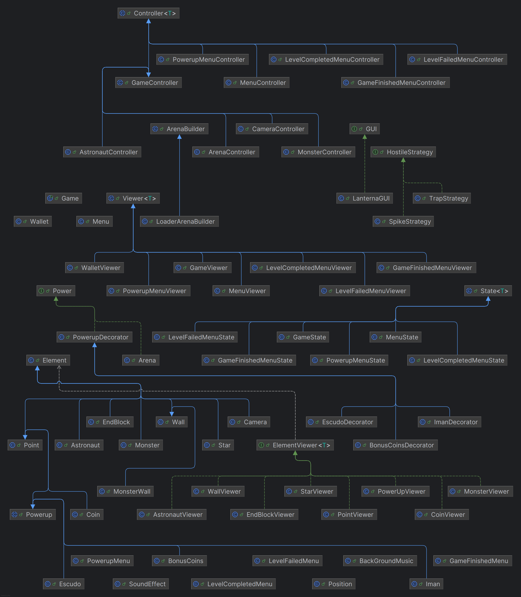

# ECLIPTICA 
## Game Description
In Ecliptica, the player plays as an astronaut navigating an arena. The goal is to collect coins, stars, and power-ups such as a Magnet to attract nearby coins, a Coin Multiplier for extra coins and a Shield to protect the player from dangerous obstacles. The astronaut moves in one direction until he finds a wall, this allows the player to jump quickly across the map in straight lines.

The game introduces two enemy types: Spike Walls that act as instant death zones, ending the game upon contact and Infected Walls that spawn spikes around them when the player passes by. As the player progresses, the arenas grow more difficult, with more obstacles to navigate.
## Mockups

 

## Player's Functionalities

### Movement
- The player can move in four directions(up, down, left & right);
- The astronaut moves until he founds a wall.

### Item Collection
- The player automatically collects items upon touching them, such as coins, points, stars, and power-ups.
- Throughout the levels, as the player collects coins and points, these contribute to the player's wallet.

## Main Game Elements

### Arena 

- Each level takes place in a unique arena, representing a different planet;
- There are traps and obstacles, both static and moving, that the player must avoid.

### Player
- Moves quickly in straight lines until hitting an obstacle;
- Dies instantly upon contact with an enemy or trap.

## Collectible Items
### Points
- Collected throughout the arenas;
- Contribute to the Wallet;
 
### Coins
- Collected throughout the arenas;
- Contribute significantly to the Wallet;

### Power-ups
- Provide temporary abilities;
- Can be upgraded in the menu to improve their duration;
- Types include:

- **Shield:** Protects the player from traps;
- **Magnet:** Attracts nearby coins and points;
- **Coin Multiplier:** Increases coins' and points' worth;
 
## Enemies
 - Instantly kill the player upon contact. There is no concept of health.
    - **Spike Walls** - Players can come into contact with Spike Walls but cannot land directly on them.
    - **Infected Walls** -  Spawns a Spike Wall in the direction of the player's movement, when he passes nearby. 

# UML Diagram

