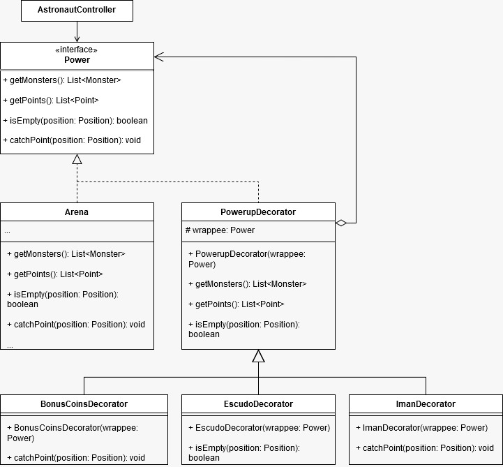
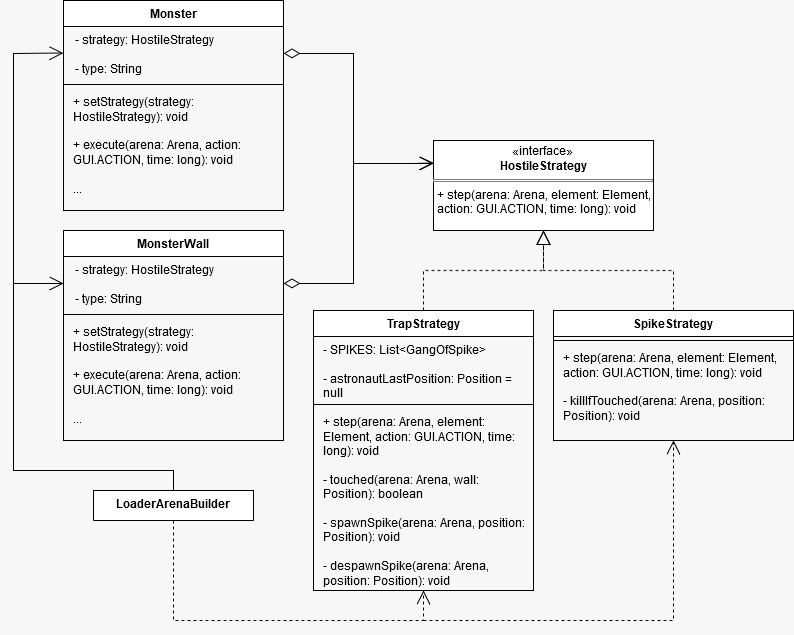

## LDTS_T05_G07 - ECLIPTICA

In Ecliptica, the player plays as an astronaut navigating an arena. The goal is to collect coins, stars, and power-ups such as a Magnet to attract nearby coins, a Coin Multiplier for extra coins and a Shield to protect the player from dangerous obstacles. The astronaut moves in one direction until he finds a wall, this allows the player to jump quickly across the map in straight lines.

The game introduces two enemy types: Spike Walls that act as instant death zones, ending the game upon contact and Infected Walls that spawn spikes around them when the player passes by. As the player progresses, the arenas grow more difficult, with more obstacles to navigate.
***
This project was developed by *Ana Pacheco* (*up202307150*@fe.up.pt) , *Carolina Mosqueiro* (*up202303637*@fe.up.pt) and *Vasco Vieira* (*up202307797*@fe.up.pt) for LDTS 2024⁄25.
***
### IMPLEMENTED FEATURES

- **Linear Movement** - The player moves swiftly in straight lines across the map, only stopping when he encounters a wall.
- **Collectibles** - The player can collect coins, points and stars scattered across the levels.
- **Wallet** - Throughout the levels, as the player collects coins and points, these contribute to the player's wallet.
- **Enemies** - All enemies instantly kill the player upon contact. There is no concept of health. 
  - **Spike Walls** - Players can come into contact with Spike Walls but cannot land directly on them, since they only cause damage if the player directly jumps into them. This allows the player to brush against Spike Walls without immediately dying, as long as the contact doesn't involve a direct collision.
  - **Infected Walls** - Contrary to Spike Walls, the player can safely come into contact with Infected Walls, as they do not oppose direct danger. Instead, if the player moves near an Infected Wall, it will spawn a Spike Wall in the direction of the player's movement. To overcome Infected Walls, the player must anticipate their behavior and avoid triggering the spikes while navigating through the map.
- **Power-ups** - Throughout the levels, the player can find different temporary Power-Ups to help him in his journey.
  - **Magnet** - Automatically attracts nearby coins.
  - **Shield** - Provides protection against enemies.
  - **Coin Multiplier** - Increases the value of coins and points. 
- **Power-Ups' Upgrades** - Initially, each Power-Up has the duration of 3.0 seconds, but the player can increase this time in the Game Shop in the Main Menu, using his Wallet. Each upgrade increases the time by 0.5 seconds. 
- **Levels** - The game features a total of 8 levels. To advance to the next level, the player must successfully complete the current one 
- **Menus** - There are 5 Menus that allow the player to navigate through the game.
  - **Main Menu** - It is possible to play or exit the game and to access the PowerUps' Menu. 
  - **PowerUp's Menu** - The player can either buy upgrades or return to the Main Menu. 
  - **Completed Level Menu** - After completing a level, the player can proceed to the next one, retry the current one or return to the Main Menu. 
  - **Failed Level Menu** - After failing a level, the player can either retry the current level or return to the Main Menu, not allowing the player to progress in the game.
  - **Completed Game Menu** - After completing all 8 levels, the player reaches a menu with a '*You Won!!*' message, where the player's only option is to return to the Main Menu.
- **Sound** - The game includes background music and sound effects. Background music plays continuously during levels and in the menus, while specific sound effects are triggered for actions like collecting coins and points and activating power-ups.
***
### PLANNED FEATURES

- **Score** - Initially, the game was going to include both a wallet and a score system. The score would have influenced the player's current level, providing a way to track progress and performance. However, this concept was discarded, and only the wallet system remains in the game.
- **Stars** - Stars can be found in the different arenas and were originally intended to serve as a classification method for each level, allowing players to evaluate their performance in completing a level. Currently, stars exist in the game but do not serve a functional purpose.
- **Player's Level** - The player's level was planned to be linked to their score, offering a sense of progression based on performance. Since the score system was removed, this feature was not implemented.

------
### DESIGN

#### MANAGING GAME'S GENERAL LOGIC, RENDERING AND PLAYER'S INPUT
  
**Problem in Context**

Combining the game’s logic, rendering, and player input handling into a single module created a messy codebase that was difficult to work with. This setup made it harder to debug, extend, or test individual components. By mixing responsibilities, it became harder to keep the code organized and maintainable.

**The Pattern**

We have applied the **MVC (Model-View-Controller)** pattern. This pattern separates the game into three components:

- **Model:** Handles game data and logic.
- **View:** Manages rendering of game elements.
- **Controller:** Processes player input and updates the model or view accordingly.

 
**Implementation**

These classes can be found in the following files:

- [Model](https://github.com/FEUP-LDTS-2024/project-t05g07/blob/fdde9131465db4737f3d4bd39291d10bf814a557/src/main/java/com/Spanca05/astronaut/model)
- [Viewer](https://github.com/FEUP-LDTS-2024/project-t05g07/blob/471be6ce1303f8316dac01fcbd60339147a2295f/src/main/java/com/Spanca05/astronaut/viewer)
- [Controller](https://github.com/FEUP-LDTS-2024/project-t05g07/blob/b3a5b09b548e040a9937ec8f1f963c0033a322e1/src/main/java/com/Spanca05/astronaut/controller)

**Consequences**

The use of the **MVC Pattern** in the current design allows the following benefits:
- Clear separation of responsibilities.
- Easier to update or replace one component without affecting other parts of the code. 
- Improved maintainability and testability.

------

#### ALTERNATING BETWEEN GAME STATES

**Problem in Context**

The game needed to switch between states, such as menus and gameplay. Implementing this with conditional logic would lead to a confusing, unmaintainable structure, making it difficult to add or modify states without risking bugs in unrelated sections.

**The Pattern**

We have applied the **State** pattern. Each state (MenuState, GameState, PowerUpMenuState, ...) is implemented as a separate class allowing a simple management of all states.

**Implementation**

These classes can be found in the following file:

- [States](https://github.com/FEUP-LDTS-2024/project-t05g07/blob/30d68004018dca18d1f09fbac16111a619e59731/src/main/java/com/Spanca05/astronaut/states)

**Consequences**

The use of the **State Pattern** in the current design allows the following benefits:
- Simple management of all states by separating each state into a dedicated class.
- Easier to add or modify states without altering existing code.
- Improved code readability.

------

#### MANAGING POWER-UPS

**Problem in Context**

Adding temporary power-ups (magnets, shields and coin multipliers) to the player required modifying the player's behaviour. Using conditional logic for each power-up would result in a confusing and unstable codebase.

**The Pattern**

We have applied the **Decorator** pattern. This pattern allowed us to extend the arena's behavior without modifying the original class. Methods such as the one which is responsible for catching one point, coin or powerup at a time could be overriden in such a way that it became possible to catch the aforementioned elements in a radius, thus constituting, for example, a magnet. This way, it would be possible to stack power-ups while keeping the core arena logic reusable by "wrapping" the object as many times as we would like.

Although the main goal with this pattern was precisely the possibility of stacking power-ups, it ended up not being possible to implement what was intended, as we belatedly acknowledged one of its main disadvantages: it's hard to remove a specific wrapper from the wrappers stack. Since each powerup has a duration for its effect, it would be troublesome to deactivate the oldest powerup once its duration ended while keeping the newest active. We considered making the duration of the oldest active powerup the same as the newest and, once it ended, unwrap everything at once, but since that is not how power-ups are usually implemented in games, the initial purpose was discarded and we settled for making only one power-up work at a time.

Nevertheless, being able to override specific methods was useful.

**Implementation**

The following figure shows how the pattern’s roles were mapped to the application classes.

These classes can be found in the following files:

- [Power-up](https://github.com/FEUP-LDTS-2024/project-t05g07/blob/c3cbb33b0dfdae7c8bb91692a1c7a561bbd93f0d/src/main/java/com/Spanca05/astronaut/decorator/PowerupDecorator.java)
- [BonusCoins](https://github.com/FEUP-LDTS-2024/project-t05g07/blob/afc4322cf3bb72bed804a890b70b9e771ea81511/src/main/java/com/Spanca05/astronaut/decorator/concretedecorators/BonusCoinsDecorator.java)
- [Sheild](https://github.com/FEUP-LDTS-2024/project-t05g07/blob/31c29ff147768f1647cf10efd742d3acc9a8b1ed/src/main/java/com/Spanca05/astronaut/decorator/concretedecorators/EscudoDecorator.java)
- [Magnet](https://github.com/FEUP-LDTS-2024/project-t05g07/blob/31c29ff147768f1647cf10efd742d3acc9a8b1ed/src/main/java/com/Spanca05/astronaut/decorator/concretedecorators/ImanDecorator.java)

**Consequences**

The use of the **Decorator Pattern** in the current design allows the following benefits:

- Enabled dynamic modification of the player’s behavior without altering the original class.
- Supports stacking multiple power-ups.
- Keeps the core player class unchanged and focused on its primary behavior.

However, it also brought us a big drawback:

- Made the AstronautController class too complex.

The pattern needs a **Client** class responsible for wrapping the arena, which cannot wrap or unwrap itself. Since the activation of a certain power-up depends on whether or not the player caught it during its movement, and the overriden methods ultimately simulate a change in the behaviour of the one who calls them, the AstronautController class became responsible not only for the player's controls, but also for activating and deactivating power-ups, wrapping and unwrapping the arena, arguably going against the Single Responsibility principle.

All in all, since the pattern did not help us implement the sole feature that made us choose it, it was not as useful as expected. We should probably have chosen a different one.

------

#### MANAGING ENEMIES

**Problem in Context**
Different enemy types required distinct behaviors. Handling these behaviors in a single enemy class would lead to code duplication and make it challenging to add new types of enemies.

**The Pattern**

We have applied the **Strategy** pattern. This pattern made it easy to introduce new enemy types by simply creating new behavior strategies, improving extensibility and reducing duplication.
This pattern made it possible to modify a enemy's strategy without altering the other enemies' code.

**Implementation**

The following figure shows how the pattern’s roles were mapped to the application classes.

These classes can be found in the following files:

- [EnemyInterface](https://github.com/FEUP-LDTS-2024/project-t05g07/blob/31c29ff147768f1647cf10efd742d3acc9a8b1ed/src/main/java/com/Spanca05/astronaut/strategy/HostileStrategy.java)
- [SpikeStrategy](https://github.com/FEUP-LDTS-2024/project-t05g07/blob/31c29ff147768f1647cf10efd742d3acc9a8b1ed/src/main/java/com/Spanca05/astronaut/strategy/SpikeStrategy.java)
- [InfectedWallStrategy](https://github.com/FEUP-LDTS-2024/project-t05g07/blob/2ac65b03de944be846fc92a2b3895ed0ffd5aec9/src/main/java/com/Spanca05/astronaut/strategy/TrapStrategy.java)

**Consequences**

The use of the **Strategy Pattern** in the current design allows the following benefits:
- Simplified the addition of new enemy behaviors by allowing each behavior to be handled in a separate class.
- Reduced code duplication by sharing common logic.
- Made enemy behavior easier to manage and modify without affecting other enemy types, enhancing flexibility.

### KNOWN CODE SMELLS

- A classe AstronautController está muito complexa e (provavelmente) vai contra o Single Responsibility ...
- A armadilha não volta a spawnar um espinho se o Astronauta ainda estiver a tocar nela e não tiver sido morto ...
- O astronauta consegue parar em posições do mapa que não devia por causa do escudo ...
- ...

### TESTING

...

### SELF-EVALUATION

- Eu: 33.3%
- Tu: 33.3%
- Ele: 33.3%
- Nós, vós, eles, deus: 0.1%
